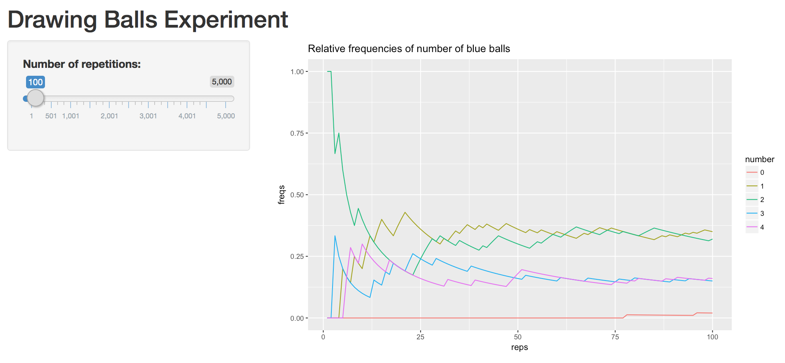
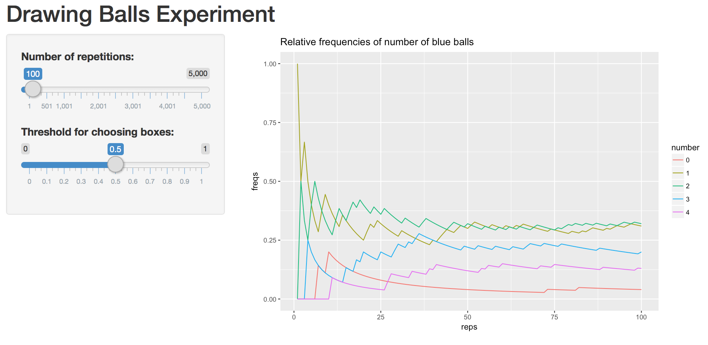
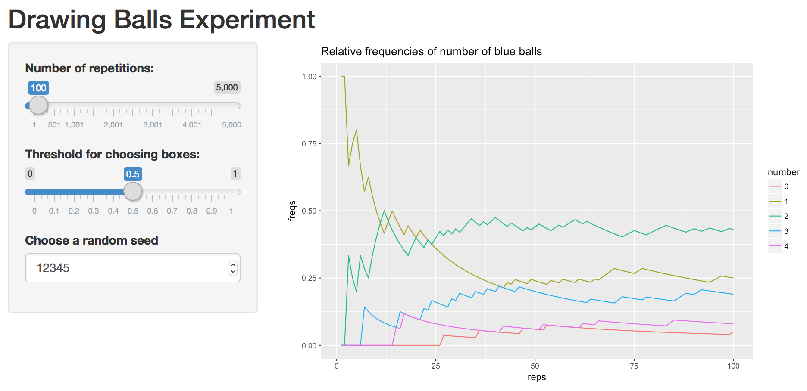

> ### Learning Objectives
>
> - getting started with simulations in R
> - learn how to create a basic shiny app
> - put in practice concepts from your introductory statistics course(s)

------

# Introduction 

Random numbers have many applications in science and computer programming,
especially when there are significant uncertainties in a phenomenon of interest.


# Computing Probabilities

With the mathematical rules from probability theory we can compute the 
probability that a certain event happens. Consider for example two bags
containing balls of different colors. Bag 1 contains 2 white balls and 1 red 
ball; bag 2 contains 3 white balls and 1 red ball. 

Suppose that a bag is chosen at random, and then a ball is picked at random 
from the selected bag. What is the given probability that:

a. the ball chosen is red
b. the ball chosen is white

This problem can be solved analytically using the formulas:

```
P(red) = P(red | bag1) P(bag1) + P(red | bag2) P(bag2)

P(white) = P(white | bag1) P(bag1) + P(white | bag2) P(bag2)
```

Instead of solving this problem analytically, you can write R code to simulate 
the experiment of picking a bag and drawing a ball. The first step consists of 
creating two bags as character vectors with the name of the colors for the balls:

```{r}
# bags
bag1 <- c('white', 'white', 'red')
bag2 <- c(rep('white', 3), 'red')
```

To compute the probability using simulations, we need to replicate the 
random experiments a large number of times (e.g. 500 or 1000 times).

```{r}
bags <- c('bag1', 'bag2')
repetitions <- 1000
drawn_balls <- character(repetitions)

set.seed(345)
for (i in 1:repetitions) {
  # select one bag
  chosen_bag <- sample(bags, 1)
  
  # draw a ball from chosen bag
  if (chosen_bag == 'bag1') {
    drawn_balls[i] <- sample(bag1, 1)
  } else {
    drawn_balls[i] <- sample(bag2, 1)
  }
}

table(drawn_balls) / repetitions
```


# A less basic probability problem

You can manually find the probabilities of the previous example. However, not
all real problems have an analytic solution. Consider the following situation.
There are two boxes with balls of different colors. Box 1 contains two `blue`
balls, and one `red` ball. Box 2 contains two `blue` balls, three `red` balls,
and one `white` ball.

The random experiment consists of generating a random number that follows a
uniform distribution (min = 0, max = 1). If the number is greater than 0.5,
then a sample __with replacement__ of size 4 is drawn from box 1. If the
random number is less than or equal to 0.5, then a sample __without replacement__
of size is drawn from box 2. The goal is to find the probability distribution 
for the number of blue balls. In other words: 

- Probability of 0 blue balls
- Probability of 1 blue ball
- Probability of 2 blue balls
- Probability of 3 blue balls
- Probability of 4 blue balls


### Your Turn

1. Create two character vectors `box1` and `box2` with colors of balls:

```{r}
# your vectors box1 and box2
box1 <- c('blue', 'blue', 'red')
box2 <- c('blue', 'blue', 'red', 'red', 'red', 'red', 'white')
```


2. The random experiment involves generating a uniform random number using 
`runif(1)`. If this number is greater than 0.5, get a `sample()` without 
replacement of `size = 4` from `box1.` Otherwise, get a `sample()` without 
replacement of `size = 4` from `box2`.

```{r}
# your code to simulate one random experiment
rand_num <- runif(1)


if (rand_num > .5)
  {
  sample(box1, size = 4, replace = TRUE) # w/ replacement
  }
if (rand_num < .5) 
  {
  sample(box2, size = 4, replace = FALSE) # w/o replacement
  }
```


3. Repeat the experiment 1000 times using a `for` loop. To store the drawn 
samples, use a matrix `drawn_balls`. This matrix will have 1000 rows and 4 columns.
In each row you assign the output of a random sample of balls.

```{r}
drawn_balls <- list()

# (repeated 1000 times)
for (i in 1:1000)
{
  rand_num <- runif(1)
  if (rand_num > .5)
    result <- sample(box1, size = 4, replace = TRUE) # w/ replacement
  else if (rand_num < .5)
    result <- sample(box2, size = 4, replace = FALSE) # w/o replacement
  drawn_balls[[i]] <- result
}
drawn_balls <- as.data.frame(do.call("rbind", drawn_balls)) 
```

Your matrix `drawn_balls` could look like this (first five rows):

```
     [,1]   [,2]    [,3]    [,4]   
[1,] "blue" "red"   "red"   "blue" 
[2,] "red"  "blue"  "white" "red"  
[3,] "red"  "blue"  "red"   "red"  
[4,] "red"  "red"   "red"   "blue" 
[5,] "red"  "red"   "blue"  "white"
```


3. Once you filled the matrix `drawn_balls`, compute the proportion of samples
containing: 0, 1, 2, 3, or 4 blue balls.
```{r}
count <- 0
blue0 <- 0
blue1 <- 0
blue2 <- 0
blue3 <- 0
blue4 <- 0
blue0_prob <- 0
blue1_prob <- 0
blue2_prob <- 0
blue3_prob <- 0
blue4_prob <- 0
probs <- list()

for (i in 1:1000){
  for (j in 1:4){
    if (drawn_balls[i, j] == 'blue')
      count <- count + 1
  }
  if (count == 0){
    blue0 <- blue0 + 1
    blue0_prob <- blue0 / i
  }
  else if (count == 1){
    blue1 <- blue1 + 1
    blue1_prob <- blue1 / i
  }
  else if (count == 2){
    blue2 <- blue2 + 1
    blue2_prob <- blue2 / i
  }
  else if (count == 3){
    blue3 <- blue3 + 1
    blue3_prob <- blue3 / i
  }
  else if (count == 4){
    blue4 <- blue4 + 1
    blue4_prob <- blue4 / i
  }
  
  prob_v <- (c(i, blue0_prob, blue1_prob, blue2_prob, blue3_prob, blue4_prob))
  probs[[i]] <-  prob_v
  
  count <- 0
}

probs <- as.data.frame(do.call("rbind", probs))

#convert counts to probabilities/ratios
blue0_prob <- blue0 / 1000
blue1_prob <- blue1 / 1000
blue2_prob <- blue2 / 1000
blue3_prob <- blue3 / 1000
blue4_prob <- blue4 / 1000

blue0_prob
blue1_prob
blue2_prob
blue3_prob
blue4_prob

#test to make sure the probabilites add up to 1
blue0_prob+blue1_prob+blue2_prob+blue3_prob+blue4_prob
  
```

\bigskip

4. Try to obtain the following plot showing the relative frequencies of number
of blue balls over the series of repetitions.

```{r freq_plot, fig.width=2, out.width='80%', echo = FALSE, fig.align='center'}
knitr::include_graphics('freqs-plot.png')
```

```{r}
library(ggplot2)
library(tidyr)

probs %>%
    gather(key,value, V2, V3, V4, V5, V6) %>%
    ggplot(aes(x=V1, y=value, colour=key)) +
    geom_line()
```


-----

## Shiny App

- Open RStudio.
- Go to the __File__ option from the menu bar.
- Select __New File__ and choose __Shiny Web App__.
- Give a name to your App, choose a location for it, and click the __Create__
button.

These steps should create a new folder in the specified directory containing
an R script file called `app.R`. This file contains a basic template with the 
following main ingredients:

- a call to `library(shiny)` at the top of the file
- the User Interface "function" `ui <- fluidPage(...)`
- the Server "function" `server <- function(input, output) {...}`
- a call to `shinyApp(ui = ui, server = server)` to run your app

By default, shiny creates a basic template with a histogram of the variable
`waiting` from the data set `faithful`. You can try running the app by clicking
on the __Run App__ button (see buttons at the top of the source pane).


## App scripts

Instead of using the default `app.R` script, you will be playing with your
own scripts to simulate the random experiment of drawing 4 balls from the 
boxes.

While working on this part of the lab, you may want to look at the 
[Shiny Widgets Gallery](https://shiny.rstudio.com/gallery/widget-gallery.html)


### App version 1

Try to create a shiny app that replicates the image below:

- there is only one widget input: slider that controls the number of repetitions

```{r app1, fig.width=4, out.width='80%', echo = FALSE, fig.align='center'}

```


### App version 2

Modify the first app to create a second shiny app that replicates the image below:

- widget input: slider that controls the number of repetitions
- widget input: slider that controls the probability threshold for choosing the 
boxes.

```{r app2, fig.width=4, out.width='80%', echo = FALSE, fig.align='center'}

```


### App version 3

Modify the second app to create a third shiny app that replicates the image below:

- widget input: slider that controls the number of repetitions
- widget input: slider that controls the probability threshold for choosing the 
boxes.
- widget input: numeric input that controls the random seed.


```{r app3, fig.width=4, out.width='80%', echo = FALSE, fig.align='center'}

```


-----

### App R scripts

In the folder of this lab, you will find several app R scripts: `app1.R`, 
`app2.R`, `app3.R`, and `app4.R`. Each of them adds a new element to the 
sidebar, so that your app becomes more flexible.

- `app1.R`: basic skeleton that includes input for number of repetitions
- `app2.R`: includes input for threshold criteria to select a box
- `app3.R`: includes input for random seed

The file `app4.R` is a bit more complex. First, we redefine `toss()` by adding 
another argument for the random seed. Notice also the use of `reactive()` to 
create reactive objects `tosses()` and `proportions()`. Likewise, in the main 
panel of outputs, we display a data table showing summary results.

