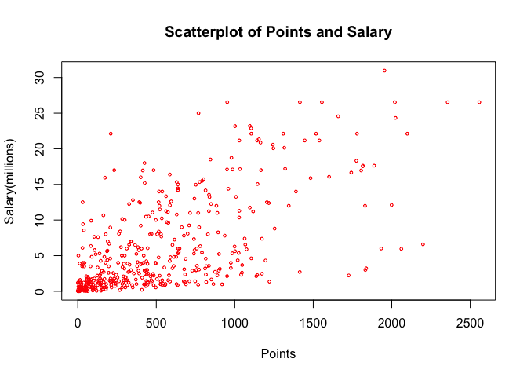
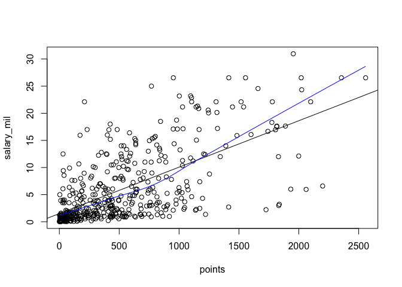
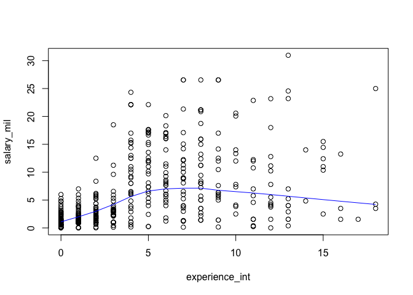

HW 1: More Vectors
================
Gaston Sanchez

``` r
#laod data file
load("data/nba2017-salary-points.Rdata")

#view data file contents
ls()
```

    ## [1] "experience" "player"     "points"     "points1"    "points2"   
    ## [6] "points3"    "position"   "salary"     "team"

Research Question:
==================

"The more points a player scores, the higher the salary?"

1. A Bit of Data Processing
---------------------------

``` r
#mak salary in terms of millions
salary_mil <- salary/1000000
round(salary_mil, 2)
```

    ##   [1] 26.54 12.00  8.27  1.45  1.41  6.59  6.29  1.83  4.74  5.00  1.22
    ##  [12]  3.09  3.58  1.91  8.00  7.81  0.02  0.26  0.27  0.01  9.70 12.80
    ##  [23]  1.55  0.54 21.17  5.24 17.64 30.96  2.50 15.33  1.59  7.33  1.58
    ##  [34] 26.54 14.20  0.54  2.70 14.38 12.00  1.92  0.87  5.30  1.20  6.05
    ##  [45] 12.25  3.73 22.12  1.20  1.19  0.54 15.94  5.00 16.96 12.00  7.40
    ##  [56]  5.89  0.54  2.87  3.39  1.50  2.71 23.18  8.40  0.39 15.73  4.00
    ##  [67]  2.50  4.84  1.02 20.07  0.42  3.85  2.28  3.00 17.10  5.37  1.55
    ##  [78] 12.52 15.20  0.92  9.61  1.40 10.50  1.81  6.35  2.57  2.37  2.70
    ##  [89] 10.23  4.58  0.65  8.80  1.05  1.80  4.00  4.00 10.77  2.46 18.31
    ## [100]  1.05 14.15  3.49  1.45  2.11  0.87  2.09 23.20  1.02  1.64 17.55
    ## [111]  1.71  3.18  5.78  0.75 14.00 13.22  2.90 15.89 22.12  4.00  5.78
    ## [122]  0.87  2.59  1.23  0.21  0.54  5.63  4.00  6.00  1.02 22.12  6.50
    ## [133]  1.55  7.00  0.87  1.70  6.00 10.99  3.68  4.62  0.65  2.26 14.96
    ## [144]  2.97 17.20  1.05  0.10  0.87  5.32  2.73  6.51  0.16 12.00  6.33
    ## [155] 12.25 13.00 12.50 20.87  6.00  0.54 24.56  0.14 11.24 21.32 17.00
    ## [166]  1.02  4.32  3.90  6.19  0.54  0.54  2.90  0.54  1.41  1.38  4.35
    ## [177] 17.00  5.00  7.25  0.98  2.61 17.00 15.00  6.54  0.03  3.91 11.75
    ## [188]  0.03  0.95 10.00  0.03  2.32  9.00  4.79  9.42  4.83  1.51  2.99
    ## [199]  1.03  1.02  8.00  0.09  0.87  8.55  1.33  6.09  0.12 21.17  1.56
    ## [210]  1.07 11.48  0.98  3.00  3.33  1.79  2.50  1.40  0.98  0.73  9.25
    ## [221] 11.13  1.17  1.55 15.33  1.02  0.98  1.40 26.54  1.18 16.66  0.38
    ## [232]  0.54  5.78 12.11  2.90  0.54 10.00  1.55  0.54  1.18  2.90  0.17
    ## [243]  0.87 17.64  1.19 20.58 14.00  3.58 15.50 14.45  0.68  0.54  1.30
    ## [254] 12.39  0.26 26.54  0.54  7.00  1.00  6.00 18.74  1.72  7.81  0.15
    ## [265]  1.32 11.00 20.14  1.55  1.27 22.87 21.17  0.54  7.38 13.25  2.20
    ## [276]  1.40  3.50  1.55  5.63 10.15  7.00  3.94 11.05  8.00 16.07  1.02
    ## [287]  2.25 11.00  0.60  0.94  1.41  2.12  2.43  2.34  5.99  2.18  2.44
    ## [298]  2.48 17.15  0.98  1.19  4.84  3.75  0.25 26.54  0.54  3.14  8.95
    ## [309]  6.55  0.94  5.70 22.12  1.37  2.90  0.98  1.29 21.17 26.54  5.51
    ## [320]  3.33  4.26  1.79  0.08 10.36  7.68 18.50  3.22 24.33  6.67 16.39
    ## [331]  0.60  1.92  8.99  9.21  2.75  0.87  1.35  0.54 15.05  8.07  3.24
    ## [342]  1.66  3.21  4.54  1.99 12.08  1.63  2.33  3.50  1.36  5.00  3.53
    ## [353] 11.20  4.60 22.12  0.02  0.54  2.98 16.96  0.58  8.08  0.17 11.29
    ## [364]  9.90  0.06 11.24  2.09  0.65  1.02  4.23 25.00  0.54  8.38 22.12
    ## [375]  4.10  0.06  4.38  0.54  0.87  2.90 17.10  0.21  8.00 12.50  4.01
    ## [386]  3.52  5.23  8.00  2.20  8.05  5.20  1.44 13.33  1.19  1.32 10.66
    ## [397]  3.55  2.02  6.01  3.50  7.64  2.35  3.91  5.96  3.87  3.80  0.14
    ## [408] 13.55  3.05  1.34  2.24  5.28  7.60  5.33  0.07  1.03 12.50  3.27
    ## [419]  1.21 18.00  1.55  5.44  6.19  1.05 16.00  1.73  0.87  4.82 12.61
    ## [430]  0.54  2.22  4.28  0.02 14.00 10.47  4.00  2.94  0.28  2.13  0.92
    ## [441] 12.41

``` r
#convert experience into integers
experience_int <- experience
experience_int[experience_int=="R"] <- 0
experience_int <- strtoi(experience_int, 10)
is.integer(experience_int)
```

    ## [1] TRUE

``` r
experience_int
```

    ##   [1]  9 11  6  0  9  5  4  2  0  6  1  3  2  1  4 10 12 11  5  1  5 12 13
    ##  [24]  0  8 13  5 13 15  5  2  5  1  7  7  0  0  4 10  2  1  5  0  6  7  2
    ##  [47]  4  7  1  0  8  8  6  9  5  3  0  0  3  0  3 12  8 11  4 12  0 14  3
    ##  [70] 10  3 10  3  3  6  2 17  4  4  0  3  8  4  1  9  0  3  8 12 11  0  7
    ##  [93]  1  6  6  5 11  1  6  1  9  8  1  1  1  0 13  3  1  5  2  3  2  0 10
    ## [116]  8  4  8  4  7  9  1  1  6  0  0  2 13  7  1  4  4 12  1  1  0  6  5
    ## [139]  3  5  0  3  5  1  5  4  1  1  3  1  4  2  5  9 11  4  4  8  9  0 13
    ## [162]  0  8  7  9  3  1  4  5  0  0  0  0  9  0  2  5  9  8  2  2  4  8  7
    ## [185]  0  1  5  0  0  4  0  0  7  1  8  0  1  2  1  3  4  0  1  6  0  4  3
    ## [208]  8  0  0  6  2  2  2  4 10  1  2  2  6 12  0 13  4  3  2  8  9  1  5
    ## [231] 13  0 11  7 13  0  7 11  0  0  3  9  1  5  2 10 14  7 15 15  2  0  2
    ## [254]  8  0  7  0 11  1  4  8  1 12  0  7  4  6 11  0 11  8  0 10 16  8  8
    ## [277] 18 11  6  5 13  1  6  8  6  3  2 15  0  1  2  3  5  1  0  3  0  2  5
    ## [300]  2  1  4 12  5  8  0  3  7  3  0  8  5  0  2  2  1  8  9 12  3 18  0
    ## [323]  0 15  6  3  3  4  6  6  0  2  4  4  2  1  2  0  7  7  1  2  0 12  0
    ## [346]  5  0  3 16  1  8  4  8  6  4  1  0  7  6  4  5  4  7  6  0  3  2  0
    ## [369]  3 12 18  0  2  4 10  0  2  0  1  3  7  0  8  9  3  0  7  6  0  8  2
    ## [392]  0 10  0  7  7  1  2  2  8  6  3  7  1  0  1  7  5  3  1  2  0  9  1
    ## [415]  0  0  2  2  1 12 16  9  2  4  6  2  1  3  5  0  1  0  2  6  9 13  0
    ## [438] 11  2  0 15

``` r
#convert position to factor, more informative data labels
fposition <- position
fposition[fposition=="C"] <- "center"
fposition[fposition=="SF"] <- "small_fwd"
fposition[fposition=="PF"] <- "power_fwd"
fposition[fposition=="SG"] <- "shooting_guard"
fposition[fposition=="PG"] <- "point_guard"
fposition <- factor(fposition)
table(fposition)
```

    ## fposition
    ##         center    point_guard      power_fwd shooting_guard      small_fwd 
    ##             89             85             89             95             83

2. Scatterplot of Points and Salary
-----------------------------------

``` r
plot(points, salary_mil, xlab = "Points", ylab = "Salary(millions)", col = "red", cex = .5, main = "Scatterplot of Points and Salary")
```

 \#\# 3. Correlation Between Points and Salary

``` r
#creating the necesary variables for our calculations
n <- length(player)

#points variables
points_mean <- 1/n * sum(points)
round(points_mean, 2)
```

    ## [1] 546.61

``` r
points_var <- sum((points - points_mean)^2)/(n-1)
points_sd <- sqrt(points_var)

#salary variables
salary_mean <- 1/n * sum(salary_mil)
round(salary_mean, 2)
```

    ## [1] 6.19

``` r
salary_var <- sum((salary_mil - salary_mean)^2)/(n-1)
salary_sd <- sqrt(salary_var)

sp_cov <- (sum((salary_mil - salary_mean)*(points - points_mean)))/(n-1)
sp_cov
```

    ## [1] 2046.213

``` r
sp_cor <- sp_cov / (salary_sd * points_sd)
sp_cor
```

    ## [1] 0.6367043

4. Simple Linear Regression
---------------------------

``` r
slope <- sp_cor * salary_sd/points_sd
slope
```

    ## [1] 0.008556681

``` r
intercept<- salary_mean - (points_mean * slope)
intercept
```

    ## [1] 1.509886

``` r
y <- intercept + (slope * points)

summary(y)
```

    ##    Min. 1st Qu.  Median    Mean 3rd Qu.    Max. 
    ##   1.510   2.845   5.206   6.187   8.184  23.398

-   Regression Equation: y = 0.0085567x + 1.5098856
-   The slope coefficent is an indicator of how much a player's salary increases as he scores more points
-   The intercept is an indicator of what a player's expected salary is if he scores 0 points
-   Predicted Salaries:
    -   0 points: = $1.51 million
    -   100 points: = $2.37 million
    -   500 points: = $5.79 million
    -   1000 points: = $10.07 million
    -   2000 points: = $18.62 million

5. Plotting the Regression Line
-------------------------------

``` r
plot (points, salary_mil, abline(intercept, slope))
lines(lowess(points,salary_mil), col="blue")
```



7.Exploring Position and Experience
-----------------------------------

``` r
plot(experience_int, salary_mil)
lines(lowess(experience_int,salary_mil), col="blue", text = "Lowess")
```

    ## Warning in plot.xy(xy.coords(x, y), type = type, ...): "text" is not a
    ## graphical parameter



``` r
# scatterplot3d(points, experience_int, salary_mil)
#boxplot(salary_mil, position)
```

8. Comments and Reflections
---------------------------
