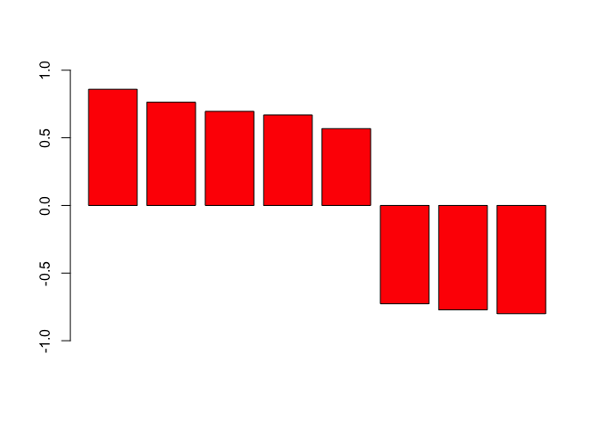
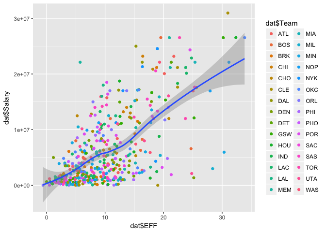
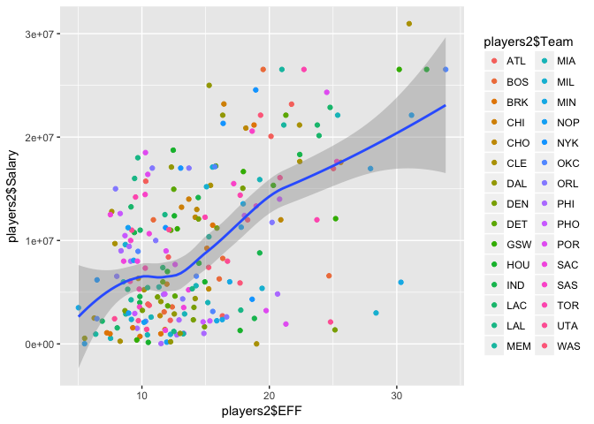

hw02-Tyler-Larsen
================

``` r
library(readr)
library(ggplot2)
library(dplyr)
```

    ## 
    ## Attaching package: 'dplyr'

    ## The following objects are masked from 'package:stats':
    ## 
    ##     filter, lag

    ## The following objects are masked from 'package:base':
    ## 
    ##     intersect, setdiff, setequal, union

1. CREATE DATA DICTIONARY FILE
------------------------------

-   Refer to Github

2. IMPORT THE DATA IN R
-----------------------

``` r
dat <- read.csv('nba2017-player-statistics.csv', stringsAsFactors = FALSE)
str(dat)
```

    ## 'data.frame':    441 obs. of  24 variables:
    ##  $ Player      : chr  "Al Horford" "Amir Johnson" "Avery Bradley" "Demetrius Jackson" ...
    ##  $ Team        : chr  "BOS" "BOS" "BOS" "BOS" ...
    ##  $ Position    : chr  "C" "PF" "SG" "PG" ...
    ##  $ Experience  : chr  "9" "11" "6" "R" ...
    ##  $ Salary      : num  26540100 12000000 8269663 1450000 1410598 ...
    ##  $ Rank        : int  4 6 5 15 11 1 3 13 8 10 ...
    ##  $ Age         : int  30 29 26 22 31 27 26 21 20 29 ...
    ##  $ GP          : int  68 80 55 5 47 76 72 29 78 78 ...
    ##  $ GS          : int  68 77 55 0 0 76 72 0 20 6 ...
    ##  $ MIN         : int  2193 1608 1835 17 538 2569 2335 220 1341 1232 ...
    ##  $ FGM         : int  379 213 359 3 95 682 333 25 192 114 ...
    ##  $ FGA         : int  801 370 775 4 232 1473 720 58 423 262 ...
    ##  $ Points3     : int  86 27 108 1 39 245 157 12 46 45 ...
    ##  $ Points3_atts: int  242 66 277 1 111 646 394 35 135 130 ...
    ##  $ Points2     : int  293 186 251 2 56 437 176 13 146 69 ...
    ##  $ Points2_atts: int  559 304 498 3 121 827 326 23 288 132 ...
    ##  $ FTM         : int  108 67 68 3 33 590 176 6 85 26 ...
    ##  $ FTA         : int  135 100 93 6 41 649 217 9 124 37 ...
    ##  $ OREB        : int  95 117 65 2 17 43 48 6 45 60 ...
    ##  $ DREB        : int  369 248 269 2 68 162 367 20 175 213 ...
    ##  $ AST         : int  337 140 121 3 33 449 155 4 64 71 ...
    ##  $ STL         : int  52 52 68 0 9 70 72 10 35 26 ...
    ##  $ BLK         : int  87 62 11 0 7 13 23 2 18 17 ...
    ##  $ TO          : int  116 77 88 0 25 210 79 4 68 39 ...

``` r
dat$Player <- as.character(dat$Player)
dat$Team <- as.character(dat$Team)
dat$Experience <- as.character(dat$Experience)
dat$Position <- as.factor(dat$Position)
dat$Salary <- as.double(dat$Salary)

dat$Rank <- as.integer(dat$Rank)
dat$Age <- as.integer(dat$Age)
dat$GP <- as.integer(dat$GP)
dat$GS <- as.integer(dat$GS)
dat$MIN <- as.integer(dat$MIN)
dat$FGM <- as.integer(dat$FGM)
dat$Points3 <- as.integer(dat$Points3)
dat$Points3_atts <- as.integer(dat$Points3_atts)
dat$Points2 <- as.integer(dat$Points2)
dat$Points2_atts <- as.integer(dat$Points2_atts)
dat$PointsFTM <- as.integer(dat$FTM)
dat$FTA <- as.integer(dat$FTA)
dat$OREB <- as.integer(dat$OREB)
dat$DREB <- as.integer(dat$DREB)
dat$AST <- as.integer(dat$AST)
dat$STL <- as.integer(dat$STL)
dat$BLK <- as.integer(dat$BLK)
dat$TO <- as.integer(dat$TO)
```

``` r
dat2 <- read_csv('nba2017-player-statistics.csv')
```

    ## Parsed with column specification:
    ## cols(
    ##   .default = col_integer(),
    ##   Player = col_character(),
    ##   Team = col_character(),
    ##   Position = col_character(),
    ##   Experience = col_character(),
    ##   Salary = col_double()
    ## )

    ## See spec(...) for full column specifications.

``` r
str(dat2)
```

    ## Classes 'tbl_df', 'tbl' and 'data.frame':    441 obs. of  24 variables:
    ##  $ Player      : chr  "Al Horford" "Amir Johnson" "Avery Bradley" "Demetrius Jackson" ...
    ##  $ Team        : chr  "BOS" "BOS" "BOS" "BOS" ...
    ##  $ Position    : chr  "C" "PF" "SG" "PG" ...
    ##  $ Experience  : chr  "9" "11" "6" "R" ...
    ##  $ Salary      : num  26540100 12000000 8269663 1450000 1410598 ...
    ##  $ Rank        : int  4 6 5 15 11 1 3 13 8 10 ...
    ##  $ Age         : int  30 29 26 22 31 27 26 21 20 29 ...
    ##  $ GP          : int  68 80 55 5 47 76 72 29 78 78 ...
    ##  $ GS          : int  68 77 55 0 0 76 72 0 20 6 ...
    ##  $ MIN         : int  2193 1608 1835 17 538 2569 2335 220 1341 1232 ...
    ##  $ FGM         : int  379 213 359 3 95 682 333 25 192 114 ...
    ##  $ FGA         : int  801 370 775 4 232 1473 720 58 423 262 ...
    ##  $ Points3     : int  86 27 108 1 39 245 157 12 46 45 ...
    ##  $ Points3_atts: int  242 66 277 1 111 646 394 35 135 130 ...
    ##  $ Points2     : int  293 186 251 2 56 437 176 13 146 69 ...
    ##  $ Points2_atts: int  559 304 498 3 121 827 326 23 288 132 ...
    ##  $ FTM         : int  108 67 68 3 33 590 176 6 85 26 ...
    ##  $ FTA         : int  135 100 93 6 41 649 217 9 124 37 ...
    ##  $ OREB        : int  95 117 65 2 17 43 48 6 45 60 ...
    ##  $ DREB        : int  369 248 269 2 68 162 367 20 175 213 ...
    ##  $ AST         : int  337 140 121 3 33 449 155 4 64 71 ...
    ##  $ STL         : int  52 52 68 0 9 70 72 10 35 26 ...
    ##  $ BLK         : int  87 62 11 0 7 13 23 2 18 17 ...
    ##  $ TO          : int  116 77 88 0 25 210 79 4 68 39 ...
    ##  - attr(*, "spec")=List of 2
    ##   ..$ cols   :List of 24
    ##   .. ..$ Player      : list()
    ##   .. .. ..- attr(*, "class")= chr  "collector_character" "collector"
    ##   .. ..$ Team        : list()
    ##   .. .. ..- attr(*, "class")= chr  "collector_character" "collector"
    ##   .. ..$ Position    : list()
    ##   .. .. ..- attr(*, "class")= chr  "collector_character" "collector"
    ##   .. ..$ Experience  : list()
    ##   .. .. ..- attr(*, "class")= chr  "collector_character" "collector"
    ##   .. ..$ Salary      : list()
    ##   .. .. ..- attr(*, "class")= chr  "collector_double" "collector"
    ##   .. ..$ Rank        : list()
    ##   .. .. ..- attr(*, "class")= chr  "collector_integer" "collector"
    ##   .. ..$ Age         : list()
    ##   .. .. ..- attr(*, "class")= chr  "collector_integer" "collector"
    ##   .. ..$ GP          : list()
    ##   .. .. ..- attr(*, "class")= chr  "collector_integer" "collector"
    ##   .. ..$ GS          : list()
    ##   .. .. ..- attr(*, "class")= chr  "collector_integer" "collector"
    ##   .. ..$ MIN         : list()
    ##   .. .. ..- attr(*, "class")= chr  "collector_integer" "collector"
    ##   .. ..$ FGM         : list()
    ##   .. .. ..- attr(*, "class")= chr  "collector_integer" "collector"
    ##   .. ..$ FGA         : list()
    ##   .. .. ..- attr(*, "class")= chr  "collector_integer" "collector"
    ##   .. ..$ Points3     : list()
    ##   .. .. ..- attr(*, "class")= chr  "collector_integer" "collector"
    ##   .. ..$ Points3_atts: list()
    ##   .. .. ..- attr(*, "class")= chr  "collector_integer" "collector"
    ##   .. ..$ Points2     : list()
    ##   .. .. ..- attr(*, "class")= chr  "collector_integer" "collector"
    ##   .. ..$ Points2_atts: list()
    ##   .. .. ..- attr(*, "class")= chr  "collector_integer" "collector"
    ##   .. ..$ FTM         : list()
    ##   .. .. ..- attr(*, "class")= chr  "collector_integer" "collector"
    ##   .. ..$ FTA         : list()
    ##   .. .. ..- attr(*, "class")= chr  "collector_integer" "collector"
    ##   .. ..$ OREB        : list()
    ##   .. .. ..- attr(*, "class")= chr  "collector_integer" "collector"
    ##   .. ..$ DREB        : list()
    ##   .. .. ..- attr(*, "class")= chr  "collector_integer" "collector"
    ##   .. ..$ AST         : list()
    ##   .. .. ..- attr(*, "class")= chr  "collector_integer" "collector"
    ##   .. ..$ STL         : list()
    ##   .. .. ..- attr(*, "class")= chr  "collector_integer" "collector"
    ##   .. ..$ BLK         : list()
    ##   .. .. ..- attr(*, "class")= chr  "collector_integer" "collector"
    ##   .. ..$ TO          : list()
    ##   .. .. ..- attr(*, "class")= chr  "collector_integer" "collector"
    ##   ..$ default: list()
    ##   .. ..- attr(*, "class")= chr  "collector_guess" "collector"
    ##   ..- attr(*, "class")= chr "col_spec"

``` r
dat2$Player <- as.character(dat2$Player)
dat2$Team <- as.character(dat2$Team)
dat2$Experience <- as.character(dat2$Experience)
dat2$Position <- as.factor(dat2$Position)
dat2$Salary <- as.double(dat2$Salary)

dat2$Rank <- as.integer(dat2$Rank)
dat2$Age <- as.integer(dat2$Age)
dat2$GP <- as.integer(dat2$GP)
dat2$GS <- as.integer(dat2$GS)
dat2$MIN <- as.integer(dat2$MIN)
dat2$FGM <- as.integer(dat2$FGM)
dat2$Points3 <- as.integer(dat2$Points3)
dat2$Points3_atts <- as.integer(dat2$Points3_atts)
dat2$Points2 <- as.integer(dat2$Points2)
dat2$Points2_atts <- as.integer(dat2$Points2_atts)
dat2$PointsFTM <- as.integer(dat2$FTM)
dat2$FTA <- as.integer(dat2$FTA)
dat2$OREB <- as.integer(dat2$OREB)
dat2$DREB <- as.integer(dat2$DREB)
dat2$AST <- as.integer(dat2$AST)
dat2$STL <- as.integer(dat2$STL)
dat2$BLK <- as.integer(dat2$BLK)
dat2$TO <- as.integer(dat2$TO)
```

3. RIGHT AFTER IMPORTING THE DATA
---------------------------------

``` r
replace(dat$Experience, dat$Experience == "R", "0")
```

    ##   [1] "9"  "11" "6"  "0"  "9"  "5"  "4"  "2"  "0"  "6"  "1"  "3"  "2"  "1" 
    ##  [15] "4"  "10" "12" "11" "5"  "1"  "5"  "12" "13" "0"  "8"  "13" "5"  "13"
    ##  [29] "15" "5"  "2"  "5"  "1"  "7"  "7"  "0"  "0"  "4"  "10" "2"  "1"  "5" 
    ##  [43] "0"  "6"  "7"  "2"  "4"  "7"  "1"  "0"  "8"  "8"  "6"  "9"  "5"  "3" 
    ##  [57] "0"  "0"  "3"  "0"  "3"  "12" "8"  "11" "4"  "12" "0"  "14" "3"  "10"
    ##  [71] "3"  "10" "3"  "3"  "6"  "2"  "17" "4"  "4"  "0"  "3"  "8"  "4"  "1" 
    ##  [85] "9"  "0"  "3"  "8"  "12" "11" "0"  "7"  "1"  "6"  "6"  "5"  "11" "1" 
    ##  [99] "6"  "1"  "9"  "8"  "1"  "1"  "1"  "0"  "13" "3"  "1"  "5"  "2"  "3" 
    ## [113] "2"  "0"  "10" "8"  "4"  "8"  "4"  "7"  "9"  "1"  "1"  "6"  "0"  "0" 
    ## [127] "2"  "13" "7"  "1"  "4"  "4"  "12" "1"  "1"  "0"  "6"  "5"  "3"  "5" 
    ## [141] "0"  "3"  "5"  "1"  "5"  "4"  "1"  "1"  "3"  "1"  "4"  "2"  "5"  "9" 
    ## [155] "11" "4"  "4"  "8"  "9"  "0"  "13" "0"  "8"  "7"  "9"  "3"  "1"  "4" 
    ## [169] "5"  "0"  "0"  "0"  "0"  "9"  "0"  "2"  "5"  "9"  "8"  "2"  "2"  "4" 
    ## [183] "8"  "7"  "0"  "1"  "5"  "0"  "0"  "4"  "0"  "0"  "7"  "1"  "8"  "0" 
    ## [197] "1"  "2"  "1"  "3"  "4"  "0"  "1"  "6"  "0"  "4"  "3"  "8"  "0"  "0" 
    ## [211] "6"  "2"  "2"  "2"  "4"  "10" "1"  "2"  "2"  "6"  "12" "0"  "13" "4" 
    ## [225] "3"  "2"  "8"  "9"  "1"  "5"  "13" "0"  "11" "7"  "13" "0"  "7"  "11"
    ## [239] "0"  "0"  "3"  "9"  "1"  "5"  "2"  "10" "14" "7"  "15" "15" "2"  "0" 
    ## [253] "2"  "8"  "0"  "7"  "0"  "11" "1"  "4"  "8"  "1"  "12" "0"  "7"  "4" 
    ## [267] "6"  "11" "0"  "11" "8"  "0"  "10" "16" "8"  "8"  "18" "11" "6"  "5" 
    ## [281] "13" "1"  "6"  "8"  "6"  "3"  "2"  "15" "0"  "1"  "2"  "3"  "5"  "1" 
    ## [295] "0"  "3"  "0"  "2"  "5"  "2"  "1"  "4"  "12" "5"  "8"  "0"  "3"  "7" 
    ## [309] "3"  "0"  "8"  "5"  "0"  "2"  "2"  "1"  "8"  "9"  "12" "3"  "18" "0" 
    ## [323] "0"  "15" "6"  "3"  "3"  "4"  "6"  "6"  "0"  "2"  "4"  "4"  "2"  "1" 
    ## [337] "2"  "0"  "7"  "7"  "1"  "2"  "0"  "12" "0"  "5"  "0"  "3"  "16" "1" 
    ## [351] "8"  "4"  "8"  "6"  "4"  "1"  "0"  "7"  "6"  "4"  "5"  "4"  "7"  "6" 
    ## [365] "0"  "3"  "2"  "0"  "3"  "12" "18" "0"  "2"  "4"  "10" "0"  "2"  "0" 
    ## [379] "1"  "3"  "7"  "0"  "8"  "9"  "3"  "0"  "7"  "6"  "0"  "8"  "2"  "0" 
    ## [393] "10" "0"  "7"  "7"  "1"  "2"  "2"  "8"  "6"  "3"  "7"  "1"  "0"  "1" 
    ## [407] "7"  "5"  "3"  "1"  "2"  "0"  "9"  "1"  "0"  "0"  "2"  "2"  "1"  "12"
    ## [421] "16" "9"  "2"  "4"  "6"  "2"  "1"  "3"  "5"  "0"  "1"  "0"  "2"  "6" 
    ## [435] "9"  "13" "0"  "11" "2"  "0"  "15"

``` r
dat$Experience <- as.integer(dat$Experience)
```

    ## Warning: NAs introduced by coercion

4. PERFORMANCE OF PLAYERS
-------------------------

``` r
#additional variables needed to compute EFF
dat$missed_FG <- dat$FGA - dat$FGM
dat$missed_FT <- dat$FTA - dat$FTM
dat$PTS <- 2*dat$Points2 + 3*dat$Points3 + dat$FTM
dat$REB <- dat$DREB + dat$OREB
dat$MPG <- dat$MIN / dat$GP

#EFF
dat$EFF <- (dat$PTS + dat$REB + dat$AST + dat$STL + dat$BLK - dat$missed_FG - dat$missed_FT - dat$TO) / dat$GP
summary(dat$EFF)
```

    ##    Min. 1st Qu.  Median    Mean 3rd Qu.    Max. 
    ##  -0.600   5.452   9.090  10.137  13.247  33.840

``` r
top_EEF <- data.frame("Player" = dat$Player, "Team" = dat$Team, "Salary" = dat$Salary, "EFF" = dat$EFF)
top_EEF <- top_EEF[order(top_EEF$EFF, decreasing = TRUE), ]
head(top_EEF, 10)
```

    ##                    Player Team   Salary      EFF
    ## 305     Russell Westbrook  OKC 26540100 33.83951
    ## 256          James Harden  HOU 26540100 32.34568
    ## 355         Anthony Davis  NOP 22116750 31.16000
    ## 28           LeBron James  CLE 30963450 30.97297
    ## 404    Karl-Anthony Towns  MIN  5960160 30.32927
    ## 228          Kevin Durant  GSW 26540100 30.19355
    ## 74  Giannis Antetokounmpo  MIL  2995421 28.37500
    ## 359      DeMarcus Cousins  NOP 16957900 27.94118
    ## 110          Jimmy Butler  CHI 17552209 25.60526
    ## 119      Hassan Whiteside  MIA 22116750 25.36364

``` r
subset(dat, dat$EFF < 0)
```

    ##              Player Team Position Experience Salary Rank Age GP GS MIN FGM
    ## 188 Patricio Garino  ORL       SG         NA  31969   17  23  5  0  43   0
    ##     FGA Points3 Points3_atts Points2 Points2_atts FTM FTA OREB DREB AST
    ## 188   7       0            5       0            2   0   0    1    6   0
    ##     STL BLK TO PointsFTM missed_FG missed_FT PTS REB MPG  EFF
    ## 188   0   0  3         0         7         0   0   7 8.6 -0.6

``` r
pts_cor <- cor(dat$EFF, dat$PTS)
reb_cor <- cor(dat$EFF, dat$REB)
ast_cor <- cor(dat$EFF, dat$AST)
stl_cor <- cor(dat$EFF, dat$STL)
blk_cor <- cor(dat$EFF, dat$BLK)
missed_fg_cor <- -1 * cor(dat$EFF, dat$missed_FG)
missed_ft_cor <- -1 * cor(dat$EFF, dat$missed_FT)
to_cor <- -1 * cor(dat$EFF, dat$TO)

EFF_cor <- c(pts_cor, reb_cor, ast_cor, stl_cor, blk_cor, missed_fg_cor, missed_ft_cor, to_cor)
EFF_cor <- sort(EFF_cor, decreasing = TRUE)
EFF_cor
```

    ## [1]  0.8588644  0.7634501  0.6957286  0.6689232  0.5679571 -0.7271456
    ## [7] -0.7722477 -0.8003289

``` r
barplot(EFF_cor, col = "red", ylim = c(-1,1))
```



5. EFFICIENCY AND SALARY
------------------------

``` r
ggplot(dat, aes(x = dat$EFF, y = dat$Salary))+
  geom_point(aes(color = dat$Team))+
  geom_smooth(method = loess)
```



``` r
players2 <- subset(dat, dat$MPG > 20)

ggplot(players2, aes(x = players2$EFF, y = players2$Salary))+
  geom_point(aes(color = players2$Team))+
  geom_smooth(method = loess)
```



``` r
EFF_sal_cor <- cor(players2$EFF,players2$Salary)
```

What can you say about the relationship between these two variables for the set of “more established players”? \* For the same efficiency, more experienced players are paid more than less experienced players.

6.COMMENT AND REFLECTIONS
-------------------------

-   What things were hard, even though you saw them in class/lab?
    -   The hardest part was definitely uploading to GitHub.
-   What was easy(-ish) even though we haven’t done it in class/lab?
    -   Getting comfortable with ggplot was easy becuase I am very interested in it and it is very straight forward.
-   Did you need help to complete the assignment? If so, what kind of help?
    -   I needed help uploading to GitHub, so I went to office hours.
-   How much time did it take to complete this HW?
    -   About 5 hours.
-   What was the most time consuming part?
    -   Definitely GitHub.
-   Was there anything that you did not understand? or fully grasped?
    -   I still don't really understand Terminal/Github.
-   Was there anything frustrating in particular?
    -   GitHub was pretty frustrating.
-   Was there anything exciting? Something that you feel proud of? (Don’t be shy, we won’t tell anyone).
    -   I really like all that can be done with ggplot.
