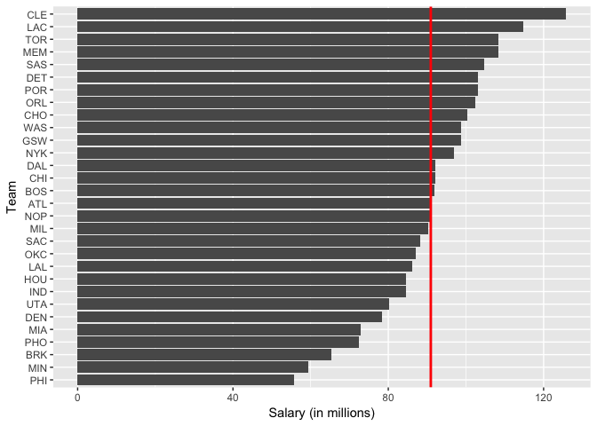
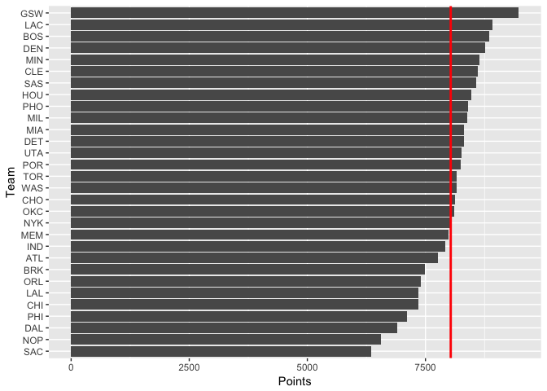
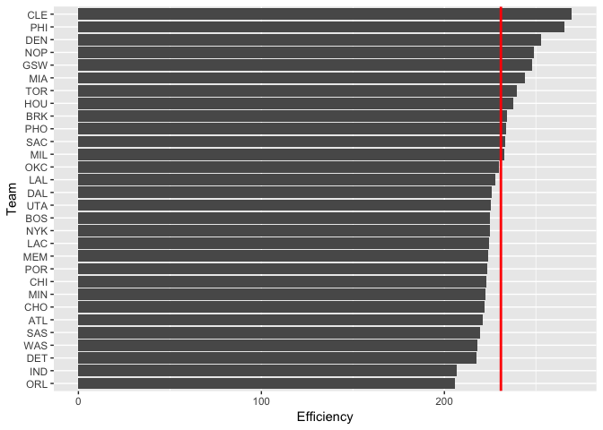
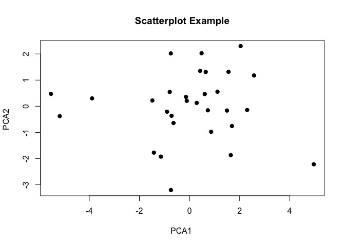
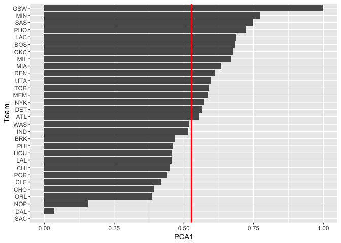

hw03
================

``` r
library(readr)
library(ggplot2)
library(dplyr)
```

    ## 
    ## Attaching package: 'dplyr'

    ## The following objects are masked from 'package:stats':
    ## 
    ##     filter, lag

    ## The following objects are masked from 'package:base':
    ## 
    ##     intersect, setdiff, setequal, union

``` r
setwd("/Users/tylerlarsen/Desktop/stat133/stat133-hws-fall17/hw03/data")
teams <- read.csv("nba2017-teams.csv")
```

NBA Teams ranked by Total Salary
================================

``` r
ggplot(data = teams, aes(x = reorder(team, salary), y = salary)) + 
  geom_bar(stat = 'identity') +
  labs(x = "Team", y = "Salary (in millions)")  +
  geom_hline(yintercept = mean(teams$salary), color = "red", size = 1) +
  coord_flip()
```



NBA Teams ranked by Total Points
================================

``` r
ggplot(data = teams, aes(x = reorder(team, points), y = points)) + 
  geom_bar(stat = 'identity') +
  labs(x = "Team", y = "Points")  +
  geom_hline(yintercept = mean(teams$points), color = "red", size = 1) +
  coord_flip()
```



NBA Teams ranked by Total Efficiency
====================================

``` r
ggplot(data = teams, aes(x = reorder(team, eff), y = eff)) + 
  geom_bar(stat = 'identity') +
  labs(x = "Team", y = "Efficiency")  +
  geom_hline(yintercept = mean(teams$eff), color = "red", size = 1) +
  coord_flip()
```



PCA
===

``` r
pca_categories <- data.frame(teams$points3, teams$points2, teams$free_throws, teams$off_rebounds, teams$def_rebounds, teams$assists, teams$steals, teams$blocks, teams$turnovers, teams$fouls)

pca <- prcomp(pca_categories, scale. = TRUE)

pca2 <- as.data.frame(pca$x)
pca2
```

    ##           PC1        PC2         PC3         PC4         PC5         PC6
    ## 1   0.2883171  0.1281265 -0.37662110  0.05846371 -0.81577779  1.05479360
    ## 2   1.6475677 -1.8678932  0.76405514  0.42625293 -0.06593249 -0.65712824
    ## 3  -0.6378694 -0.6410895  0.22935061  1.44393440  0.94153023  0.54367247
    ## 4  -0.7889514  0.5491124 -0.60195923 -0.67912579 -1.16899495  0.26543356
    ## 5  -1.4213891 -1.7716179  0.06965446 -1.46128376 -0.33447964 -1.00304721
    ## 6  -1.1429197 -1.9254795  1.52944441 -0.92018847  0.51632174  0.80388374
    ## 7  -5.1770470 -0.3771922 -0.57418726 -0.15582933  0.34019400 -1.16907587
    ## 8   0.8628216 -0.9755539  1.46124859 -0.56620095 -0.92612560  0.90334885
    ## 9   0.4228059  1.3520635  0.13570258 -2.30329670 -0.40261878  0.54552661
    ## 10  4.9580722 -2.2173199 -2.76959752  0.08471363  0.20640878  0.01060511
    ## 11 -0.7434842 -3.2031420  1.36421946  0.46234050 -0.36120510  0.39567494
    ## 12 -0.1393098  0.3561238 -1.02790899  0.28589100 -0.01867971 -0.43924208
    ## 13  1.6926408 -0.7550453  0.71696986 -0.16730840 -0.06326830 -0.95111309
    ## 14 -0.7449230  2.0200116  0.24390065  0.06178328 -0.12857151  0.78675331
    ## 15  0.6071090  0.4667924  1.01584644  0.57980481 -0.09939715 -0.92251122
    ## 16  1.1154708  0.5570744 -0.33891652 -0.37752165  1.55230433  0.38200023
    ## 17  1.4939629 -0.1637954 -1.22775117  0.53728244 -0.04710364 -0.38142691
    ## 18  2.5754284  1.1769429  0.09336693  0.17845744 -1.40052852 -0.34754189
    ## 19 -3.8867632  0.3023898 -1.48727427 -0.61277868  0.53752971  0.04164853
    ## 20  0.4804728  2.0259452  0.31561640 -0.99657031  1.35262790  0.41593151
    ## 21  1.5554071  1.3170619  0.62703090  0.14532653 -0.09884759  0.40751411
    ## 22 -1.4831168  0.2204544 -0.15779244 -0.06926670 -0.46680198  0.35121485
    ## 23 -0.7149664 -0.3641317 -0.85296962  2.03636182  0.01702133  1.20233350
    ## 24  2.0387934  2.2997473  1.19875720  1.59199314  0.03583968 -0.46908946
    ## 25 -0.8965058 -0.2071566  1.04317848  0.48282344  0.89593901 -0.39860601
    ## 26 -5.5291364  0.4742780 -0.69205701  0.96804120 -0.55714627 -0.02674618
    ## 27  2.2990719 -0.1427248 -1.21779382 -0.74662155  0.50765029 -0.12947540
    ## 28  0.6469827  1.3120040  0.44963692 -0.03210040 -0.04584683 -1.51958116
    ## 29  0.7307586 -0.1550934  0.51540008 -0.27881211  1.22136639  0.25535629
    ## 30 -0.1093009  0.2091070 -0.44855015  0.02343454 -1.12340751  0.04889350
    ##            PC7         PC8         PC9        PC10
    ## 1  -0.81472595  0.14539925  0.37587325  0.26519116
    ## 2   0.78846154 -0.24687999  0.03346811 -0.51337752
    ## 3  -0.77843833 -0.55484088  0.73947492 -0.02703596
    ## 4  -0.51882882  0.98604391  0.11116259 -0.23729687
    ## 5  -1.00666498 -0.17904267  0.21998426 -0.13337993
    ## 6  -0.07660705 -0.35614466 -0.29276673  0.29193783
    ## 7   0.85059160  0.38613408  0.17406220  0.37620335
    ## 8   0.07031503 -0.39123961 -0.44974326 -0.11811577
    ## 9   1.01042129 -0.69211113  0.48097936  0.05977366
    ## 10  0.59550700  0.21761372 -0.07824300  0.19657255
    ## 11  0.07925693  1.28827001 -0.22574692  0.19116107
    ## 12 -0.18907467 -0.36433485 -0.07053325  0.22247823
    ## 13 -0.02461385 -0.67959980  0.41729081  0.06438414
    ## 14  1.24941507  0.47326108  0.65718523  0.17985593
    ## 15  0.74842650  0.60819837  0.29012417 -0.57927711
    ## 16  0.71890691  0.26800916 -0.39157682 -0.17484080
    ## 17  0.17554932 -0.52657920 -0.18474880  0.02786174
    ## 18 -0.21454084  0.06504525 -0.48092634 -0.03822571
    ## 19 -1.08074944 -0.06806383 -0.30848245 -0.41279728
    ## 20 -0.07540947  0.51548960 -0.65975738 -0.11834046
    ## 21 -0.83261297  0.47794508  0.24305736  0.14605693
    ## 22  0.08425696 -0.62807367  0.05670088 -0.40997267
    ## 23  0.12132518  0.11762043  0.18962442 -0.21915585
    ## 24 -0.44337725 -0.44999508 -0.40108654  0.15800037
    ## 25  0.13264720 -0.19682818 -0.34595108  0.28808346
    ## 26  0.44380221 -0.32402504 -0.38680879  0.04504957
    ## 27 -0.43262618  0.27411421  0.03513969  0.05141205
    ## 28 -0.51375147  0.59101898  0.23466108  0.20892464
    ## 29 -0.41375738 -0.25045244  0.38844040 -0.02919999
    ## 30  0.34689589 -0.50595209 -0.37085735  0.23806925

``` r
plot(pca2$PC1,pca2$PC2, main="Scatterplot Example", 
    xlab="PCA1 ", ylab="PCA2 ", pch=19)
```



``` r
pca3 <- (pca2$PC1-min(pca2$PC1)) / (max(pca2$PC1) - min(pca2$PC1))
teams_pc <- data.frame(teams$team, pca3)

ggplot(data = teams_pc, aes(x = reorder(teams.team, pca3), y = pca3)) + 
  geom_bar(stat = 'identity') +
  labs(x = "Team", y = "PCA1")  +
  geom_hline(yintercept = mean(teams_pc$pca3), color = "red", size = 1) +
  coord_flip()
```


