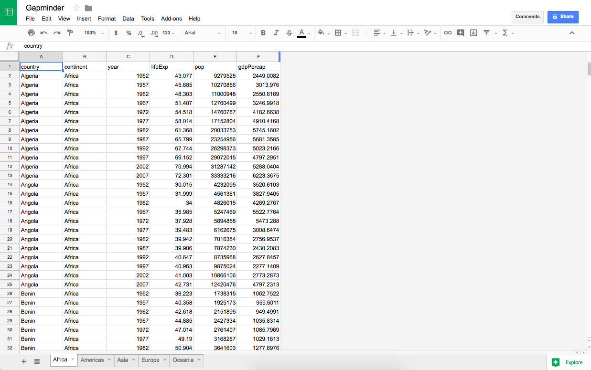

> ## Introduction

Up until this point, we have been given all the data we need, most often in the form of an already somewhat tidy .csv file. We've then been loading the data in one of two ways: either we have manually downloaded and then read in the file into an R script, or we have download files through links to Github. 

But what happens if our data in neither hosted on Github, nor available in a readily available .csv file, and is instead hosted on Google Sheets? Luckily, there are packages to help us pull in that data directly to R, too. In particular, we will be looking at the `googlesheets` package, which is very helpful for the often time consuming "data gathering" phase of the data cycle.


 

> ## Background

To get started, we first need to install the `googlesheets` package:

```{r}
#install.packages("googlesheets")
library("googlesheets")
```

`googlesheets` was built with `dplyr` in mind, so we must also install and load `dplyr`:

```{r, message=FALSE}
#install.packages("dplyr")
library("dplyr")
```

A little bit about `googlesheets` function naming conventions:

* All functions that have anything to do with Google Sheets begin with `gs_`,
* All functions that operate on specific worksheets begin with `gs_ws_`,
* And all functions that communicate with Google Drive begin with `gd_`, but we won't be getting much into this.


And finally, two quick vocabulary terms:

* Sheet: refers to the entire file, including each tab (worksheet) within. In Excel, this would be the whole Excel file, while in Google it is the whole Google Sheet file.
* Worksheet: each page of the sheet, these can be navigated through the tabs found at the bottom of the sheet.

> ## Example:  

Now that we know a bit about the `googlesheets` package and what it can do, let's see for ourselves. The developers have made demonstrations easy, and within the package their is already a Google Sheet loaded with data from Gapminder. In order to access this sheet, we must first be authenticated. Running the code below will direct you to the Google Sheets sign in page, and then add the "Gapminder" sheet to your Google Sheets account.

```{r}
gs_gap() %>% 
  gs_copy(to = "Gapminder")
```

Now if you to to your Google Sheets account on your browser, you should now see a new sheet titled "Gapminder" waiting for you. When you open it up,it should look like this:  

 

Next, we want to register the sheet in R as a `googlesheet` object. There are three functions we can use to do this: `gs_title`, `gs_key`, and `gs_url`. These three In this example, we'll use `gs_title`:

```{r}
gap <- gs_title("Gapminder")
```

Here's an overview of what the sheet looks like:

```{r}
gap
```

Next, we'll look at how we can create a Google Sheet of our own, starting from scratch. In order to do this, we will use the built in data frame `mtcars`, as well as the function `gs_new`. We can then view our new Google Sheet in the browser using the function `gs_browse()`.

```{r}
# takes three arguments (only "input" is reqired)
# "cars" is the name of the new Google Sheet
# input is the dataframe we are sending to Google sheets
# trim eleimates the unnecessary rows and columns surrounding our data
cars_sheet <- gs_new("cars", input = mtcars, trim = TRUE)

cars_sheet %>% gs_browse()
```

Proof that this worked: 

```{r}
cars_sheet
```

> ## Discussion

This package also offers a host of other features and functions, more than I could possibly show in one blog post. Additional arguments to the `gs_new` function allow you to easily change the visibility and the permissions on a Google Sheet. `gs_download()` lets the user download the Google Sheet as a csv, rather than directly editing the Google Sheet itself. `gs_edit_cells()` allows you to directly edit the cells of a Google Sheet. `gs_delete()` lets you remotely delete files from your Google Sheets. The `gs_webapp_` function family allows for easy integration of Google Sheets into Shiny apps.

> ## Take Home Message

Used in conjunction with other packages, `googlesheets` can be a very powerful tool. Packages such as `dplyr` are valuable when it comes to wrangling the collected data, while `ggplot` can be extremely useful when used in conjunction with `googlesheets` in order to visualize the collected data. 

One particularly interesting and useful application of this package is to Google surveys, which output their data to Google Sheets. This package is especially useful because it allows for live monitoring of survey results from the comfort of Rstudio, rather than having to use the limited analysis features provided by Google Sheets.

With `googlesheets`, the possibilities are endless.

> ## Sources

https://www.linkedin.com/pulse/update-google-sheets-via-r-automatically-tanya-cashorali/
https://github.com/ucb-stat133/stat133-fall-2017/blob/master/slides/01-big-picture.pdf
https://github.com/jennybc/googlesheets
https://trinkerrstuff.wordpress.com/
https://rawgit.com/jennybc/googlesheets/master/vignettes/basic-usage.html#download-sheets-as-csv-pdf-or-xlsx-file
https://www.rstudio.com/wp-content/uploads/2015/02/rmarkdown-cheatsheet.pdf
https://simplystatistics.org/2016/08/26/googlesheets/


